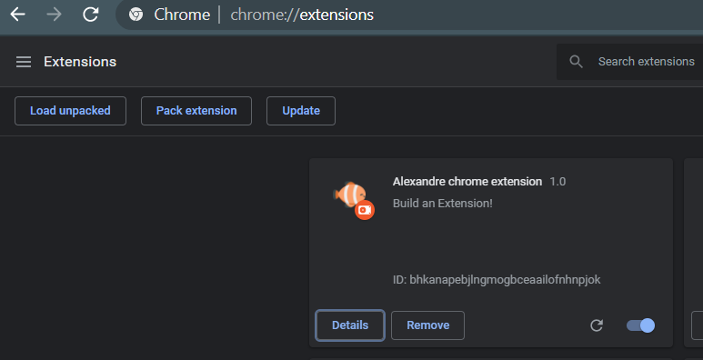

# Chrome-extension

SEND MESSAGES TO A REMOTE API CHATBOX

- A simple extension that retrieves information to this chatbox (https://wagon-chat.herokuapp.com/engineering) everytime the button is clicked.
- Multitab functionality
- Tools used:
  HTML5
  CSS
  json
  JavaScript
  

  A function sendData(data) in the manifest file, send comments once it is clicked. 
  The button is triggered once and it will submit comments to the chat as many times as it is clicked
  
  
  If you run errors, please run these commands.
  > bundle
  > yarn
  
  
  
  If ou find any mistake, please let know or collaborate directly to this repository.
